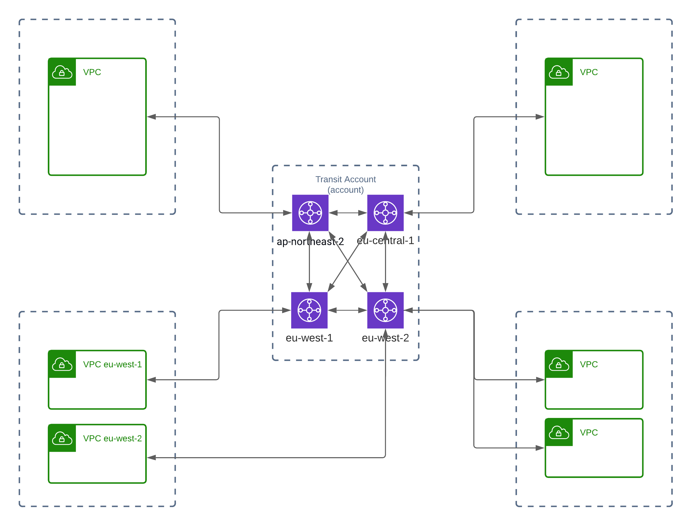
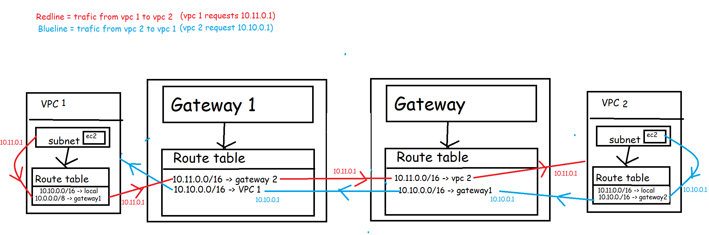

# AWS HUB SPOKE NETWORK

provisions a mesh of transit gateways accross multiple regions and shares them with other accounts (which can add their own vpc's) creating a hub-spoke network.

<center></center>

## Setup

### AWS prep

This stack is dependant on aws RAM (Resource Access Manager) so make sure this service is enabled (https://docs.aws.amazon.com/ram/latest/userguide/getting-started-sharing.html#getting-started-sharing-orgs)

## local setup

- install nix

```sh
sh <(curl -L https://nixos.org/nix/install) --no-daemon
```

- then enter the nix shell

```sh
nix-shell env.nix
```

Make sure you have access to a AWS_PROFILE with permissions to deploy

```
export AWS_PROFILE=myprofile
```

## lint

within the nix shell

```
prettier --write .
```

## pulumi

to apply changes first select the stack you want to edit

```
pulumi stack select
```

then apply the changes (this will first ask for conformation)

```
pulumi up
```

it's possible to only check your changes in pulumi without deploying with

```
pulumi diff
```

## Connecting to the Global Network from another account

To connect to the Global Network from a VPC in another account we have to:

- Make sure the CIDR of the VPC doesn't overlap with ANY CIDR block in the region config.
- Add the cidr of the new vpc to the correct region in the config
- Create a VPC attachment in the other account (the Transit Gateway should be shared via RAM there).
- Create a static route in the route table of the subnets the instances are in to the transit gateway

The following image visualizes how the route tables will route data trough the network:

<center></center>

### Pulumi

To connect a pulumi vpc to the global network the following code will create the connection (this will not route any trafic yet but will allow us to update the route tables):

```ts
const globalAttach = new aws.ec2transitgateway.VpcAttachment(
  `${prefix}-global-tg-attach`,
  {
    transitGatewayId: { transitGatewayID }, // depends on the region you are connecting from
    subnetIds: [], // this has to be 1 subnet of each availibility zone your instances are in (can't be duplicates)
    vpcId: vpc.id, // the id of the vpc you are connecting
    tags: {
      Name: `${prefix}-global-tg-attach`,
    },
  },
  {
    ...opts,
    deleteBeforeReplace: true, // needed as we can't replace this in place
  },
);
```

Then to start routing trafic trough the gateway update the route table of the subnets your instances are in (this can differ per project).
The following code updates all route tables created by the vpcx (aws crosswalk)

```ts
// when creating our own route tables
const privateRouteTable = new aws.ec2.RouteTable(
  `${prefix}_private_route_table`,
  {
    vpcId: vpc.id,
    routes: [
      {
        cidrBlock: "0.0.0.0/0",
        natGatewayId: NATGateway.id,
      },
      {
        cidrBlock: "10.0.0.0/8",
        transitGatewayId: globalAttach.transitGatewayId,
      },
    ],
    tags: {
      Name: `${prefix}_private_route_table`,
    },
  },
  opts,
);

// when using awsx (aws crosswalk) to create a vpc
const globalRoutes = vpcx.privateSubnets.then((r) =>
  r.map((x, i) => {
    if (!x.routeTable?.id) {
      throw Error(
        "Can't add global route to subnets without a rout table attached",
      );
    }
    return new aws.ec2.Route(
      `${prefix}-global-route-${i}`,
      {
        routeTableId: x.routeTable?.id,
        transitGatewayId: globalAttach.transitGatewayId,
        destinationCidrBlock: "10.0.0.0/8",
      },
      opts,
    );
  }),
);
```

### Terraform

To attach a terraform vpc to the global network use the following block (this does not route trafic yet)

```terraform
// we use a list to make gateways optional (setting it to 0 gateways)
variable "transit_gateway_ids" {
  type = list(string)
  default = []
}

resource "aws_ec2_transit_gateway_vpc_attachment" "global_attachment" {
  for_each           = toset(var.transit_gateway_ids)
  subnet_ids         = [aws_subnet.subnet.id]
  transit_gateway_id = each.key
  vpc_id             = aws_vpc.vpc.id

  tags = merge(
    local.common_tags,
    {
      "Name" = "${var.tag_prefix}_global_attachment"
    },
  )
}
```

Then to start routing trafic trough the gateway use the following routetable route table (specifically the `dynamic "route"`)

```terraform
resource "aws_route_table" "route_table" {
  vpc_id = aws_vpc.vpc.id

  # Allow internet trafic in and out
  route {
    cidr_block = "0.0.0.0/0"
    gateway_id = aws_internet_gateway.gateway.id
  }

  dynamic "route" {
    for_each = aws_ec2_transit_gateway_vpc_attachment.global_attachment
    content {
      cidr_block = "10.0.0.0/8"
      transit_gateway_id = route.value.transit_gateway_id
    }
  }

  tags = merge(
    local.common_tags,
    {
      "Name" = "${var.tag_prefix}_route_table"
    },
  )
}
```
